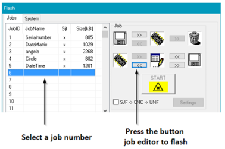

# 5. Communication bi-directionnelle au travers d'un réseau industriel (Profinet, EtherNetIP, MQTT)

Ce chapitre détaille les procédures de communication et de pilotage du laser **IK-SERIES UV 5** via une interface réseau **Profinet**, **EtherNetIP** ou **MQTT**. Il s'adresse aux intégrateurs, régleurs et automaticiens souhaitant automatiser le processus de marquage laser en environnement de production.

## 5.1. Introduction

### Architecture et flux de travail
Le contrôle du système de marquage repose sur une architecture hybride, combinant la préparation graphique sur PC et le pilotage automatisé par automate programmable (API/PLC). Le processus global se déroule en plusieurs grandes étapes :

*   **Création et chargement des jobs** : Les modèles de marquage (ou jobs) sont initialement créés, configurés et sauvegardés à l'aide du logiciel **SamLight**. Ils sont ensuite transférés et stockés directement dans la mémoire interne du laser.
*   **Interface de communication (Profinet/EtherNetIP/MQTT vers RS232)** : Afin d'intégrer le laser dans un réseau industriel standard, les requêtes envoyées par l'automate transitent via le bus de terrain. Une passerelle matérielle convertit ensuite ces requêtes pour communiquer avec la carte de pilotage laser via son interface série RS232.
*   **Pilotage par commandes ASCII** : Une fois les jobs en mémoire, l'automate prend le relais. Il contrôle le laser en envoyant des chaînes de caractères au format ASCII.

### Capacités du pilotage automatisé
L'envoi de ces commandes ASCII à travers l'interface Profinet/EtherNetIP/MQTT vers RS232 permet une grande flexibilité en production. Il est notamment possible de :

*   **Gérer le cycle de marquage** : Sélectionner un job précis en mémoire et déclencher son exécution.
*   **Modifier des données à la volée** : Mettre à jour des informations dynamiques en temps réel juste avant le marquage, telles que des numéros de série, des dates, des codes d'équipe ou des références de pièces, sans avoir besoin de repasser par le logiciel SamLight.

---

## 5.2. Création du modèle de marquage (Job) sous SamLight

Avant de pouvoir piloter le laser depuis l'automate, vous devez créer le modèle de base du marquage, appelé un **Job**, à l'aide du logiciel SamLight. Ce fichier contiendra tous les éléments graphiques (lignes, logos) ainsi que les textes dynamiques qui seront mis à jour par l'automate. Ce job contient également les paramètres laser qui seront utilisés lors du marquage (puissance, fréquence, vitesse…).

### 5.2.1 Créer un nouveau Job et ajouter un texte
1.  Ouvrez le logiciel SamLight et créez un nouveau document vierge (`File > New Job`).
2.  Utilisez l'outil de création de texte pour placer une nouvelle entité sur votre zone de travail.
3.  Saisissez un texte par défaut (par exemple, "Texte_Test" ou "SN-0000"). Ce texte sert uniquement de repère visuel lors de la conception ; il sera de toute façon écrasé par la commande de l'automate lors de la production.

### 5.2.2 Paramétrage indispensable pour le pilotage automate
Pour que l'automate puisse "trouver" et modifier ce texte spécifique avec une commande ASCII (comme la commande `TX` vue précédemment), l'entité doit impérativement respecter deux conditions dans ses propriétés :

*   **Lui donner un nom d'entité unique** : Sélectionnez votre texte dans SamLight. Dans le panneau des propriétés, cherchez l'onglet **Entity Info** (Informations de l'entité) et remplissez le champ **Name** (Nom). *Exemple : Nommez-le `NumSerie1`. C'est ce nom exact que l'automate ciblera dans sa ligne de commande (`TX NumSerie1`).*
*   **Désactiver l'incrémentation automatique** : Si votre entité texte est configurée comme un numéro de série dynamique (type `ScSerialnumber2D`), le laser ne doit pas incrémenter le compteur de lui-même, puisque c'est l'automate (le "maître") qui lui dictera la valeur à chaque cycle. Allez dans l'onglet **Serial Number** et assurez-vous que la valeur **Inc. Value** (Valeur d'incrément) est strictement réglée sur **0**.

### 5.2.3 Sauvegarde
Une fois vos textes et logos en place, sauvegardez votre Job (par exemple sous le nom `Job_N1.sjf`). Ce fichier est maintenant prêt à être transféré dans la mémoire de la carte SCAPS.

---

## 5.3. Transfert du Job dans la mémoire du laser

Une fois le Job configuré dans SamLight, il doit être transféré physiquement dans la mémoire interne (**Flash**) de la carte de pilotage laser. Cela permet de déconnecter le PC et de laisser l'automate piloter le laser de manière 100% autonome.

### 5.3.1 Principe de l'Option Flash
L'option Flash du laser agit comme un disque dur interne. Les Jobs y sont sauvegardés sous forme d'emplacements numérotés (**Index**). C'est ce numéro d'index que l'automate appellera plus tard avec la commande `JN`.

### 5.3.2 Procédure de transfert depuis SamLight
1.  **Ouvrir le Job** : Assurez-vous que votre fichier (ex : `Job_N1.sjf`) est bien ouvert et actif dans SamLight.
2.  **Accéder au menu Flash** : Dans la barre de menus, ouvrez le menu `Extras` puis `Flash`.
3.  **Sélectionner l'emplacement (Index)** : Sélectionnez l'emplacement souhaité, par exemple le Job n°6.
    *   *Attention : Mémorisez bien ce numéro. Si vous l'enregistrez sur l'emplacement 6, l'automate devra obligatoirement envoyer la commande `JN 6<CR>` pour le charger.*
4.  **Lancer le transfert** : Cliquez sur le bouton `Job editor to Flash`. Une barre de progression indiquera le transfert vers la carte SCAPS.

5.  **Validation** : Une fois le transfert terminé, le Job est stocké de manière non-volatile.

!!! info "Note de mise en service"
    Lors des phases de test, si vous modifiez le design du marquage ou la position d'un texte dans SamLight, vous devez impérativement refaire cette manipulation d'enregistrement vers la Flash pour écraser l'ancien modèle.

> [Consulter la notice complète de l'option Flash](https://download.scaps.com/downloads/Software/SAMLight/Manual/html/index.html?option_flash.htm)

---

## 5.4. Structure du protocole de communication

Pour interagir avec le laser, l'automate doit formuler ses requêtes en respectant une syntaxe stricte. Toutes les commandes utilisent le protocole **FCI** (Flash Command Interface) et sont basées sur des caractères ASCII.

### Format général d'une requête
La forme générale pour envoyer des données au laser est la suivante :
`<Commande> <Par1> <Par2> .. <ParN><CR>`

*   **`<Commande>`** : Le mnémonique de la commande (ex: `JN`). Les commandes sont insensibles à la casse.
*   **`<Par1>` à `<ParN>`** : Les paramètres de la commande séparés par un espace.
*   **`<CR>`** : Le caractère de fin de ligne (Carriage Return, code ASCII 13 ou `0x0D` en hexadécimal). **Ce caractère est obligatoire.**

### Gestion des réponses et temporisation
Chaque commande envoyée génère une réponse de la part de la carte.

*   **Règle d'or** : Il est strictement interdit d'envoyer une nouvelle commande tant que la réponse de la commande précédente n'a pas été entièrement reçue par l'automate.
*   L'automate doit implémenter des boucles de temporisation (*time-out*). Sauf indication contraire, la carte répond en quelques millisecondes.
*   Une réponse réussie commence par le code `0:`.

---

## 5.5. Exemples de commandes courantes

Voici les commandes ASCII les plus couramment utilisées pour un cycle de production automatisé.

**Sélectionner un Job (JN) :**
Charge en mémoire active un job préalablement transféré sur la carte.

• Syntaxe : JN <Numéro_Job><CR>

• Exemple d'envoi : JN 1<CR> (Sélectionne le job numéro 1)

• Réponse attendue : 0:<CR> (Succès)

**Lancement du marquage (M) :**
Démarre le process de marquage du job sélectionné.

• Syntaxe : M <1><CR>

• Exemple d'envoi : M 1<CR> (Démarre le marquage)

• Réponse attendue : 0:<CR> (Succès)

• Note : M 0<CR> permet d'arrêter le marquage.

**Modification d'un numéro de série (TX) :**
Modifie le contenu de l'entité texte sélectionnée.

• Syntaxe : TX <nom entité> <contenu><CR>

• Exemple d'envoi : TX NumSerie1 SN-2026-1234<CR>

• Réponse attendue : 0:<CR> (Le texte est mis à jour en mémoire)

> [Consulter la liste complète des commandes FCI](https://download.scaps.com/downloads/Software/Programming/Flash_Control_Interface/Manual/html/index.html?command_list.htm)
