# 6. Configuration de la Passerelle Profinet

**Introduction et principe de fonctionnement**

Afin de permettre une communication fluide avec l'automate (API), ce laser de marquage intègre en interne une passerelle de communication réseau.

Le rôle de cette passerelle est d'assurer la conversion bidirectionnelle entre le protocole industriel Profinet (côté automate) et la liaison série RS232 (côté laser).

* **Côté Automate (Profinet) :** Les données sont envoyées et reçues sous forme de trames d'octets (Hexadécimal) via la table d'échange.
* **Côté Carte de commande du Laser (RS232) :** Le contrôleur interne du laser ne comprend et n'attend que des caractères ASCII.

La passerelle configurée dans ce document va donc se charger de traduire les trames Profinet envoyées par l'automate en commandes ASCII compréhensibles par le laser (et inversement pour les retours d'état).

## 6.1 Prérequis

!!! info "Téléchargement requis"
    Vous pouvez télécharger le logiciel et le dossier de configuration en un seul clic :
    **[📥 Télécharger le package Profinet (Logiciel + Configuration)](https://drive.google.com/file/d/1SNInJnRlS2pk8QM3qjuAth7XH2oxFpvF/view?usp=drive_link)**

Avant de commencer, assurez-vous de disposer des éléments suivants :

* Le logiciel Compositor SW67601 installé sur votre PC.
* Le dossier de configuration nommé `IKSERIES` fourni avec la documentation.
* Un PC configuré avec une adresse IP fixe définie sur `192.168.0.1`.
* Un câble Ethernet standard.

## 6.2 Connexion physique et préparation des fichiers

1. Connectez le câble Ethernet entre le port réseau de votre PC et le port Ethernet identifié "Laser" sur la machine.
2. Mettez le laser sous tension.
3. Sur votre PC, copiez le dossier de configuration `IKSERIES`.
4. Collez ce dossier dans le répertoire d'installation du logiciel, à l'emplacement suivant : `C:\Program Files (x86)\ADFweb\Compositor_SW67601\Projects`

## 6.3 Chargement et paramétrage de la configuration

1. Ouvrez le logiciel Compositor SW67601.
2. Cliquez sur le bouton **Open configuration**.
3. Sélectionnez la configuration `IKSERIES` dans la liste et validez.

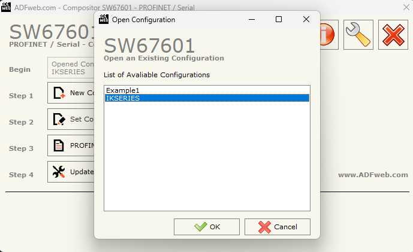

4. Cliquez ensuite sur le bouton **Set communication**.

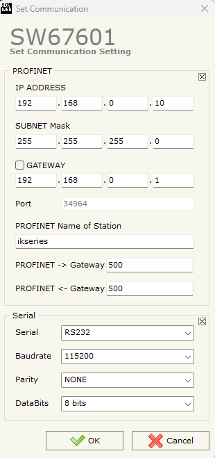

5. Dans la section **Profinet**, renseignez l'IP Profinet souhaitée pour la passerelle ainsi que le masque de sous-réseau (ce dernier peut généralement être laissé par défaut).
6. Dans la section **RS232**, vérifiez que les paramètres de communication sont configurés comme suit (ne les modifiez pas) :
    * **Port :** RS232
    * **Baudrate :** 115200
    * **Parity :** NONE
    * **Data Bits :** 8 bits
7. Cliquez sur **OK** pour valider les paramètres.

## 6.4 Création du fichier GSDML

1. Dans le menu principal, cliquez sur le bouton **Profinet XML**.
2. Choisissez l'emplacement de sauvegarde sur votre PC et enregistrez le fichier GSDML (ce fichier sera nécessaire plus tard pour l'intégration dans le logiciel de l'automate).

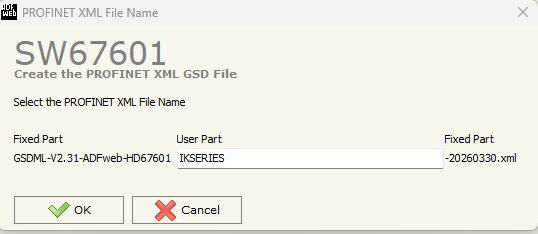

## 6.5 Transfert de la configuration vers le laser

1. Cliquez sur le bouton **Update device**.
2. Saisissez l'adresse IP de la passerelle.

!!! warning "Attention"
    Lors de la première configuration (sortie d'usine), l'adresse IP par défaut à renseigner est `192.168.0.10`. Si vous effectuez une modification ultérieurement, il faudra renseigner l'adresse IP Profinet que vous avez définie à l'étape 3.

3. Cliquez sur le bouton **PING**.
4. Si la communication est établie, le logiciel affichera le message **Device Found**.

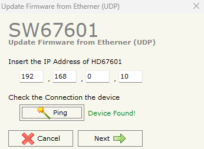

5. Cliquez alors sur **NEXT**, puis sur **Execute update firmware**.

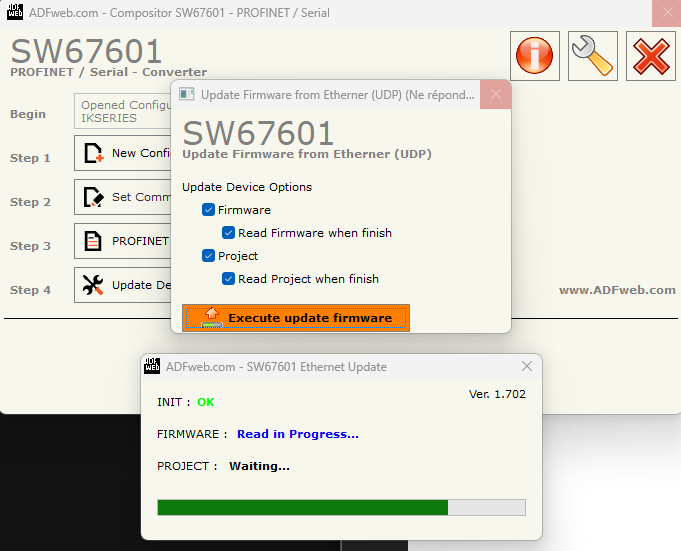

6. Patientez jusqu'à la fin du transfert de la configuration.
7. Une fois l'opération terminée, débranchez le câble Ethernet du PC et connectez le port "Laser" directement à votre réseau automate (API).

## 6.6 Intégration du module dans l'automate (Fichier GSDML)

**Prérequis pour cette étape :**

* Le laser est sous tension.
* Le câble Ethernet relie désormais l'automate (API) au port "ETH LASER" de la machine.
* La passerelle a été configurée avec succès (voir l'étape 5).

**Procédure d'intégration matérielle :**

1. Ouvrez le logiciel de programmation de votre automate.
2. Accédez au gestionnaire de fichiers de description d'appareils et importez le fichier GSDML que vous avez généré et sauvegardé à l'étape 4.

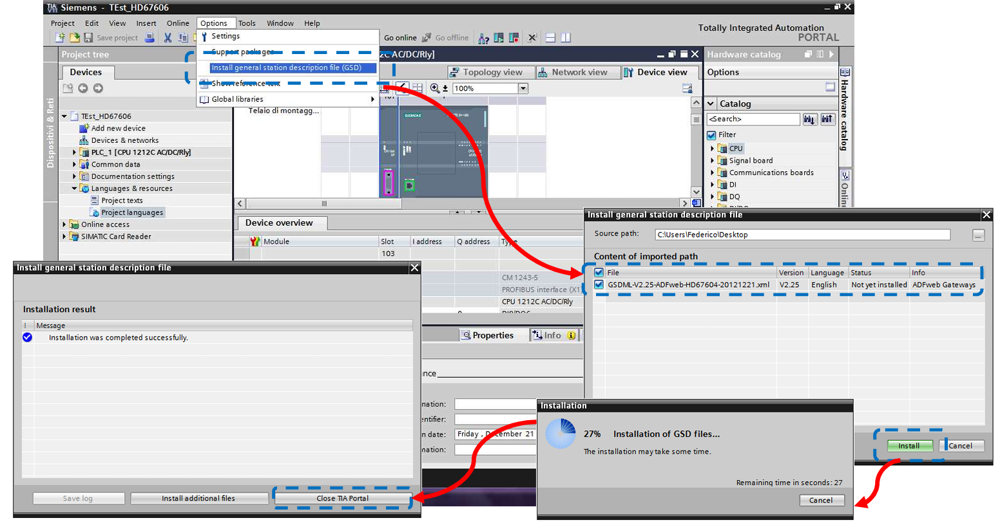

3. Installez le fichier GSDML pour l'ajouter au catalogue matériel de votre logiciel.
4. Dans la vue réseau ou configuration matérielle de votre projet, ajoutez le nouveau module Profinet (correspondant au laser) à votre réseau.

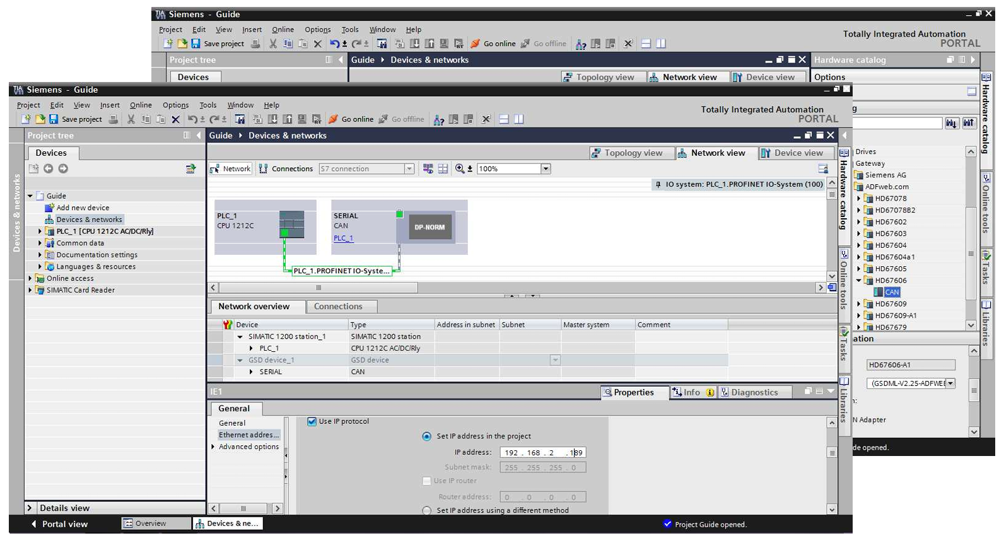

5. Accédez aux propriétés du module nouvellement ajouté pour configurer ses paramètres réseau :
    * **Adresse IP :** Renseignez l'adresse IP Profinet configurée précédemment dans la passerelle.
    * **Nom d'appareil (Device Name) :** Attribuez le nom Profinet au module (assurez-vous que ce nom correspond aux attentes du réseau de votre automate).
6. Une fois la configuration matérielle terminée, chargez (téléchargez) la configuration matérielle dans l'automate.

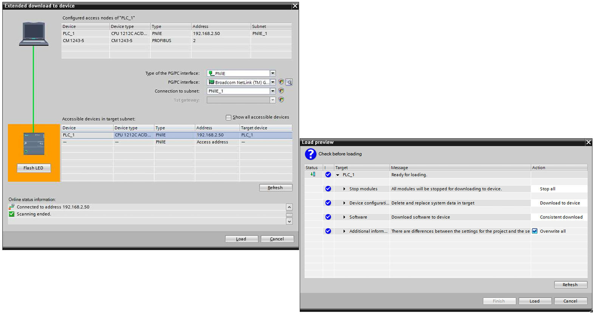

## 6.7 Communication et structure de la table d'échange (Envoi de commandes)

Une fois le module intégré, la communication entre l'automate et le laser s'effectue via l'échange d'octets de données. L'automate doit envoyer les commandes ASCII attendues par le laser sous forme de trames hexadécimales.

**Exemple d'application : Commande "Lancer le marquage"**

Pour lancer un marquage, le laser attend la commande ASCII `M 1` suivie d'un retour chariot. Voici comment structurer la trame de sortie (Output) dans la table d'échange de l'automate pour envoyer cette commande :

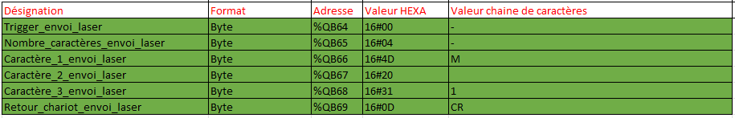

**Décryptage de la trame envoyée au laser :**

* **Octet 0 :** `16#00` ou `16#80` > Octet de contrôle (Bit de basculement / Toggle bit).
* **Octet 1 :** `16#04` > Longueur de la commande utile (ici, 4 octets vont suivre).
* **Octet 2 :** `16#4D` > Code hexadécimal du caractère ASCII "M".
* **Octet 3 :** `16#20` > Code hexadécimal du caractère ASCII "Espace".
* **Octet 4 :** `16#31` > Code hexadécimal du caractère ASCII "1".
* **Octet 5 :** `16#0D` > Code hexadécimal de fin de trame (CR - Carriage Return).

!!! danger "IMPORTANT - Mécanisme de déclenchement (Toggle)"
    Pour que la passerelle et le laser prennent en compte une nouvelle exécution de commande, la valeur du premier octet (Octet 0) doit obligatoirement basculer entre `16#00` et `16#80` à chaque nouvel envoi.
    
    * Envoi n°1 : Octet 0 = `16#00`
    * Envoi n°2 : Octet 0 = `16#80`
    * Envoi n°3 : Octet 0 = `16#00`
    * Et ainsi de suite...
    
    Si la valeur de cet octet ne change pas par rapport à l'envoi précédent, la commande sera considérée comme déjà traitée et ignorée par le système.

## 6.8 Lecture des réponses du laser (Table d'échange en entrée)

De la même manière que pour l'envoi de commandes, le laser transmet ses retours d'état et ses réponses à l'automate via une trame de données entrantes (Input).

**Exemple de réception : Le laser renvoie "0:"**

L'image ci-dessous illustre la structure de la table d'échange lors de la réception de la chaîne de caractères `0:`.

!!! info "Précision importante"
    Dans la syntaxe du laser, le retour `0:` signifie que la commande précédente a été reçue et exécutée correctement (le "0" correspondant au code "Success").

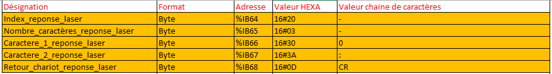

**Décryptage de la trame reçue depuis le laser :**

* **Octet 0** (ex. `%IB64`) : `16#20` > Index de réponse (Octet de contrôle / Toggle de réception).
* **Octet 1** (ex. `%IB65`) : `16#03` > Nombre de caractères utiles de la réponse (ici, 3 octets vont suivre).
* **Octet 2** (ex. `%IB66`) : `16#30` > Code hexadécimal du caractère ASCII "0" (Code de statut).
* **Octet 3** (ex. `%IB67`) : `16#3A` > Code hexadécimal du caractère ASCII ":" (Séparateur).
* **Octet 4** (ex. `%IB68`) : `16#0D` > Code hexadécimal de fin de trame (CR - Carriage Return).

!!! note "Note pour la programmation (Gestion de la réception)"
    Tout comme pour l'envoi, l'Index de réponse (Octet 0) est crucial. La valeur de cet octet va changer à chaque nouveau message envoyé par la passerelle. Pour traiter correctement les réponses du laser, le programme automate doit surveiller un changement de valeur sur cet octet.

## 6.9 Tableau des codes de retour et d'erreurs du laser

Lorsque le laser répond à une commande, le premier caractère de sa réponse (avant les éventuelles données) correspond à un code d'état. Voici le tableau récapitulatif des codes de retour possibles pour faciliter le diagnostic dans l'automate :

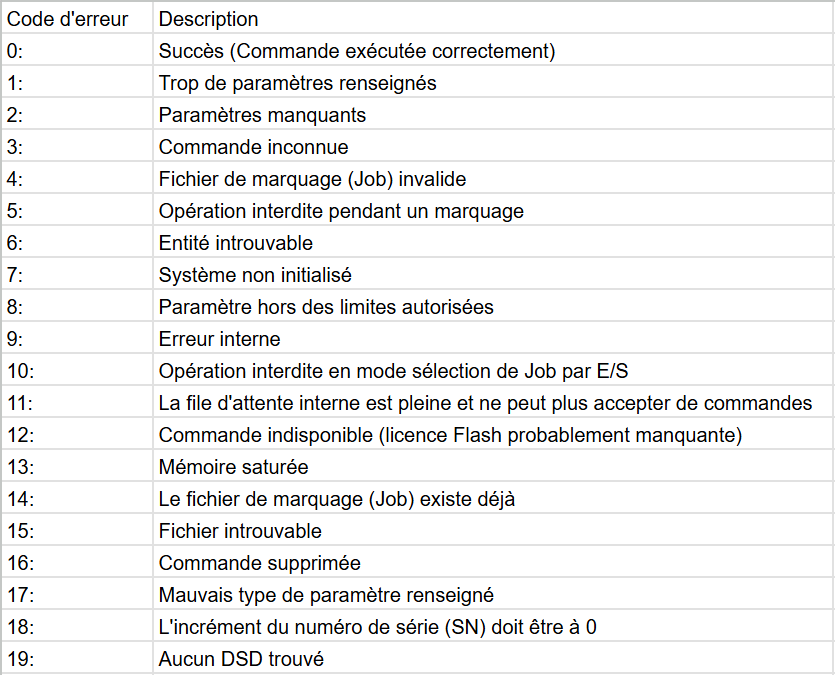
