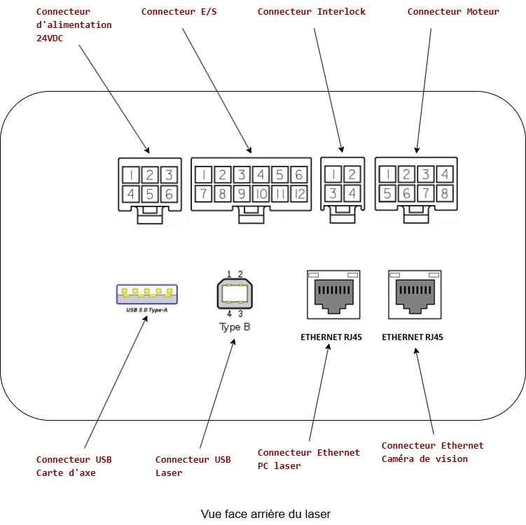
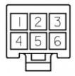
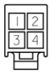
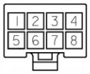
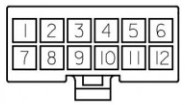
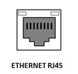
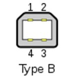
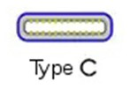

## Configuration des Connecteurs

Cette page détaille la configuration des broches pour les principaux connecteurs de l'équipement.

### Connecteur d'alimentation 24VDC (6 broches)

Ce connecteur fournit l'alimentation principale 24VDC à l'appareil.

| Broche | Couleur câble | Désignation |
| :--- | :--- | :--- |
| 1 | MARRON | +24VDC IN |
| 2 | GRIS | +24VDC IN |
| 3 | BLEU | 0VDC IN |
| 4 | NOIR | 0VDC IN |
| 5 | Jaune/Vert | Terre |
| 6 | NC | NC |

!!! quote "Référence du câble longueur 5m optionnel"
    IKS-CA-PW5
---

### Connecteur Interlock (4 broches)

Ce connecteur gère la boucle de sécurité (interlock). Les contacts sont secs et se ferment lorsque la chaîne de sécurité est active (par exemple, porte fermée et verrouillée).

| Broche | Couleur câble | Désignation |
| :--- | :--- | :--- |
| 1 | MARRON | CANAL 1 DÉPART |
| 2 | JAUNE | CANAL 1 RETOUR |
| 3 | BLANC | CANAL 2 DÉPART |
| 4 | VERT | CANAL 2 RETOUR |

> **Note :** Un contact sec est établi entre les broches 1-2 et entre les broches 3-4 lorsque la porte est verrouillée et la chaîne de sécurité est validée.

!!! quote "Référence du câble longueur 5m optionnel"
    IKS-CA-IL5
---

### Connecteur Moteur (8 broches)

Ce connecteur contrôle le moteur pas-à-pas et reçoit les signaux du fin de course.

| Broche | Couleur câble | Désignation |
| :--- | :--- | :--- |
| 1 | BLANC | +24VDC OUT |
| 2 | MARRON | 0VDC REF |
| 3 | VERT | LIMIT SWITCH |
| 4 | NC | NC |
| 5 | JAUNE | A+ MOTEUR |
| 6 | GRIS | A- MOTEUR |
| 7 | ROSE | B+ MOTEUR |
| 8 | BLEU | B- MOTEUR |

> **Note :** L'interrupteur de fin de course "LIMIT SWITCH" est un capteur inductif de type PNP.

!!! quote "Référence du câble longueur 5m optionnel"
    IKS-CA-MP5
---

### Connecteur E/S (12 broches)

Ce connecteur regroupe les entrées et sorties numériques pour le contrôle des opérations de marquage.

| Broche | Couleur câble | Désignation |
| :--- | :--- | :--- |
| 1 | BLANC | +24VDC OUT |
| 2 | MARRON | 0VDC REF |
| 3 | VERT | ENTRÉE START MARK |
| 4 | JAUNE | ENTRÉE STOP MARK |
| 5 | GRIS | ENTRÉE OPTO_IN_2 |
| 6 | ROSE | ENTRÉE OPTO_IN_3 |
| 7 | BLEU | ENTRÉE OPTO_IN_4 |
| 8 | ROUGE | SORTIE LASER ACTIF |
| 9 | NOIR | SORTIE MARQUAGE EN COURS |
| 10 | VIOLET | SORTIE OPTO_OUT_3 |
| 11 | GRIS/ROSE | SORTIE OPTO_OUT_4 |
| 12 | ROUGE/BLEU | SORTIE OPTO_OUT_5 |

#### Spécifications Électriques

Les entrées et sorties de ce connecteur présentent les caractéristiques électriques suivantes :

**Entrées :** Les entrées acceptent une tension de 5 à 24VDC, référencée au 0VDC REF. Elles sont compatibles avec la plupart des signaux logiques industriels standards.

**Sorties :** Les sorties fournissent une tension de 24VDC, référencée au 0VDC REF, avec un courant maximum de 200mA par sortie. Cette capacité permet de piloter directement des voyants LED, des relais ou d'autres dispositifs de signalisation.

!!! quote "Référence du câble longueur 5m optionnel"
    IKS-CA-ES5

### Connecteur Ethernet PC laser

Ce connecteur permet de connecter le laser à un PC au travers d'une liaison Ethernet.

!!! quote "Référence du câble longueur 5m optionnel"
    IKS-CA-ETHL

### Connecteur Ethernet Caméra de vision

Ce connecteur permet de connecter la caméra de vision ou le lecteur de code sur votre système au travers d'une liaison Ethernet.

!!! quote "Référence du câble longueur 5m optionnel"
    IKS-CA-ETHV

### Connecteur USB - Laser

Ce connecteur permet de connecter le laser à un PC au travers d'une liaison USB de type B.

!!! quote "Référence du câble longueur 5m optionnel"
    IKS-CA-USBB

### Connecteur USB - Carte d'axe

Ce connecteur permet de connecter la carte d'axe intégrée au laser au travers d'un connecteur de type C.

!!! quote "Référence du câble longueur 5m optionnel"
    IKS-CA-USBC
