# 4. Installation et Configuration du logiciel SAMLight

## 4.1 Prérequis

Avant de procéder à l'installation, veuillez vérifier que vous disposez des éléments suivants :

* L'exécutable d'installation du logiciel SAMLIGHT.
* Les fichiers de configuration.
* Le fichier de correction optique.
* Le laser IK-SERIES alimenté et connecté en USB à votre ordinateur.

Vous pouvez télécharger le logiciel et les fichiers de configuration en cliquant sur le lien suivant :
**[📥 Télécharger le logiciel SAMLight (Logiciel + Configuration )](https://drive.google.com/uc?export=download&id=1oamHv5DN0xic6myk0kiK7bC055td7rIE )**

## 4.2 Installation du logiciel SAMLIGHT

1. Effectuez un clic droit sur l'exécutable pour lancer l'assistant d'installation en tant qu'administrateur.
2. Suivez les instructions à l'écran. Il est fortement recommandé de conserver les répertoires d'installation par défaut.
3. Une fois l'installation terminée, **ne lancez pas le logiciel immédiatement**.

## 4.3 Intégration des fichiers de configuration

Cette étape permet d'appliquer les paramètres de configuration spécifiques à votre système de marquage.

1. Copiez l'ensemble des fichiers contenus dans le dossier `config`.
2. Collez les fichiers à l'emplacement suivant : `C:\scaps\sam2d\system`
3. Confirmez le remplacement des fichiers existants si Windows vous y invite en sélectionnant "Remplacer les fichiers dans la destination".

## 4.4 Ajout du fichier de correction optique

Le fichier de correction optique est indispensable pour compenser les distorsions de la lentille et garantir la précision géométrique de votre marquage laser.

1. Copiez le fichier `correction <modèle laser>.ucf`.
2. Collez le fichier à l'emplacement suivant : `C:\scaps\sam2d\usc1`

## 4.5 Configuration système via SC-Setup

Cette étape permet de lier le logiciel à votre licence via un mot de passe de sécurité.

1. Ouvrez l'explorateur de fichiers et naviguez jusqu'au dossier des outils SAMLIGHT : `C:\scaps\sam2d\tools`
2. Double-cliquez sur le fichier `sc_setup.exe` pour l'exécuter.
3. Le système vous demandera d'entrer un mot de passe.

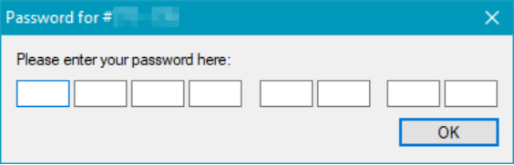

4. Copiez votre mot de passe complet et collez-le dans la première case de la fenêtre.
5. Appuyez deux fois sur la touche Entrée de votre clavier pour valider.
6. Cliquez ensuite sur le bouton **hardware settings**. Une nouvelle boîte de dialogue s'affiche.

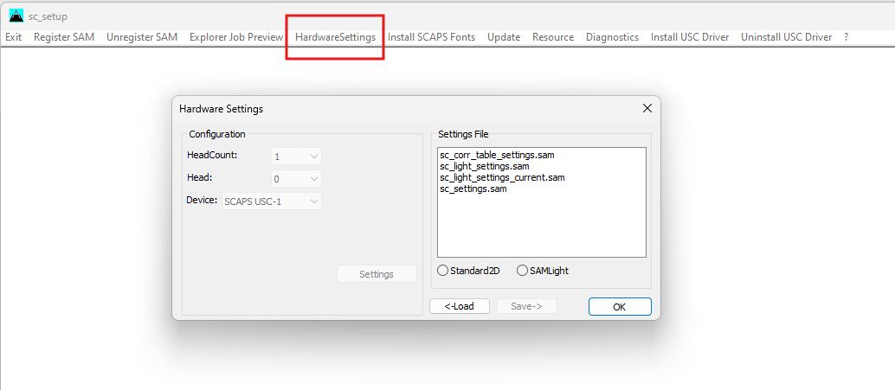

7. Cochez la case **samlight**, puis cliquez sur le bouton **load**.

!!! note "Écriture des paramètres"
    Cette étape est essentielle, elle sert à écrire les paramètres systèmes directement dans la carte de pilotage du laser IK-SERIES.

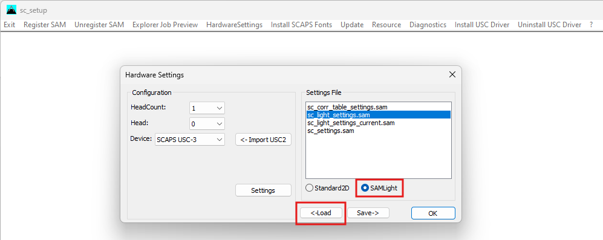

8. Cliquez ensuite sur **Settings**, puis sur **driver settings**.

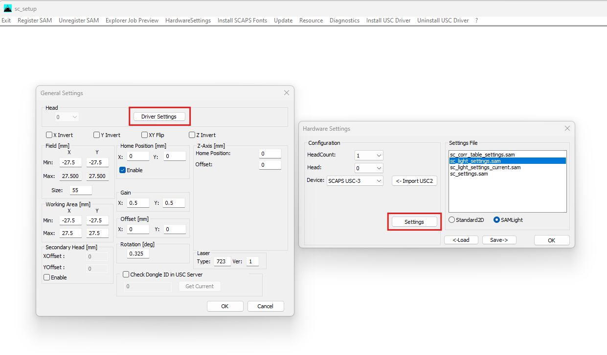

9. Dans la section dédiée à la "correction" (en haut à gauche), cliquez sur **settings**.

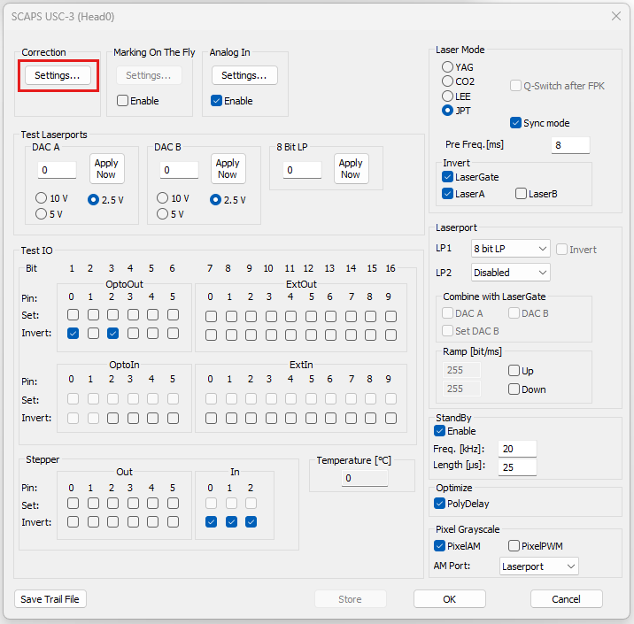

10. Importez votre fichier de correction optique (le fichier avec l'extension `.ucf`) en utilisant le bouton **Browse**.

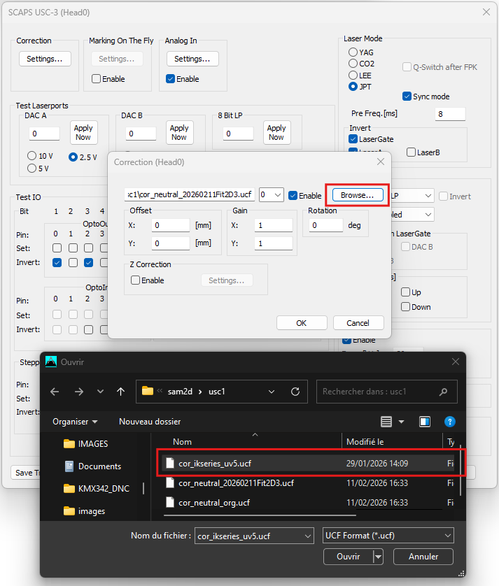

11. Cliquez sur **OK** pour valider et revenir à la fenêtre "driver settings".

## 4.6 Configuration des Entrées et Sorties (Opto IN / Opto OUT)

Toujours depuis le menu "driver settings", vous avez la possibilité d'adapter la polarité des signaux d'entrée et de sortie selon les besoins de votre intégration. Pour modifier la polarité d'un signal, il suffit de cliquer sur le bouton **INVERT** correspondant.

### Paramétrage des Sorties (Opto OUT)

* **Comportement par défaut :** Lorsqu'une sortie est à l'état 0, la carte envoie un signal de 24V.
* **Opto OUT 0 :** Cette sortie indique qu'un marquage est en cours. Vous pouvez modifier sa polarité si nécessaire en utilisant les checkboxs "invert" sous chaque sortie.
* **Sorties 3, 4 et 5 :** Ce sont les seules autres sorties que vous êtes autorisé à inverser.

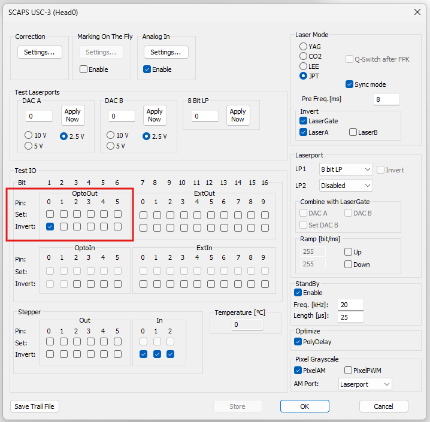

!!! danger "Attention"
    Il est impératif de ne pas toucher aux réglages des autres sorties sous peine de dysfonctionnement.

### Paramétrage des Entrées (Opto IN)

* **Comportement par défaut :** Lorsqu'on envoie un signal de 24V sur une entrée, celle-ci passe à l'état 1.
* **Opto IN 5 :** Cette entrée indique que le laser est actif (boucle de sécurité armée et laser prêt à émettre). Vous pouvez choisir d'inverser la polarité de cette entrée selon vos besoins en utilisant la checkbox "invert" sous l'entrée 5.
* **Opto IN 2, 3, 4 :** Vous pouvez choisir d'inverser la polarité de ces entrées selon vos besoins en utilisant les checkboxs "invert" sous chaque entrée.
* **Opto IN 0 et 1 (Prédéfinies) :** Ces deux entrées ont des fonctions figées et dédiées au cycle. La polarité par défaut n'est pas modifiable :
    * **Opto IN 0 :** Démarrage du marquage.
    * **Opto IN 1 :** Arrêt du marquage.

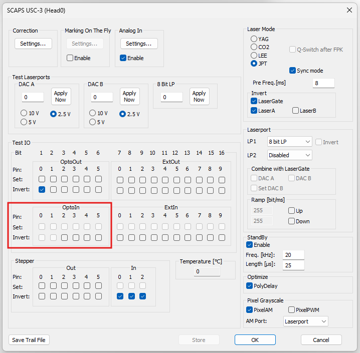

!!! danger "Avertissement critique concernant le paramétrage"
    Les réglages détaillés dans les étapes précédentes (fichiers de configuration, fichier de correction optique et polarité des I/O autorisées) sont les seuls paramètres que vous devez modifier. Il est strictement interdit d'altérer les autres valeurs ou options présentes dans l'interface sc-setup ou driver settings. Toute modification non encadrée par cette notice expose le matériel à un risque élevé de dysfonctionnement et peut entraîner des dommages irréversibles au système laser.

## 4.7 Sauvegarde des paramètres et fermeture

Une fois la configuration des entrées et sorties terminée, il est indispensable de sauvegarder correctement vos modifications pour qu'elles soient prises en compte :

1. Toujours dans la fenêtre "driver settings", cliquez sur le bouton **Store**.

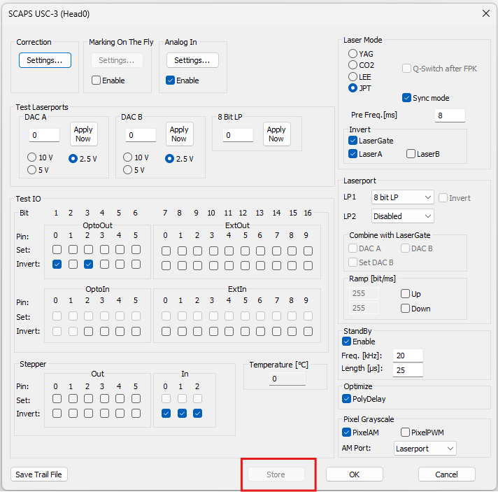

2. Cliquez ensuite sur le bouton **OK** pour quitter le menu des paramètres du driver.
3. Cliquez à nouveau sur **OK** pour fermer la fenêtre intermédiaire.
4. Enfin, de retour dans la fenêtre principale "hardware settings", cliquez sur le bouton **save** pour enregistrer définitivement toute la configuration matérielle.

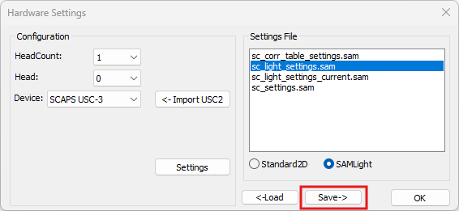

## 4.8 Changement de la langue du logiciel (Optionnel)

Pour terminer la configuration dans l'utilitaire, vous avez la possibilité de modifier la langue de l'interface de SAMLIGHT :

1. Toujours depuis la fenêtre principale de l'utilitaire sc-setup, cliquez sur le menu **resource**.
2. Une nouvelle fenêtre de dialogue s'affiche à l'écran.

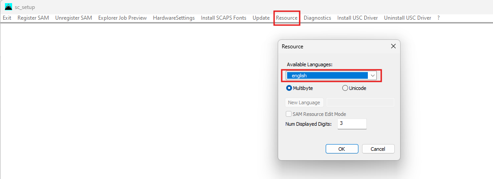

3. Sélectionnez la langue souhaitée pour le système dans la liste proposée.
4. Validez votre choix pour appliquer la modification.

Une fois cette dernière étape effectuée, vous pouvez fermer l'utilitaire sc-setup. L'installation et la configuration de base sont désormais terminées. Votre logiciel SAMLIGHT est prêt à être lancé !
