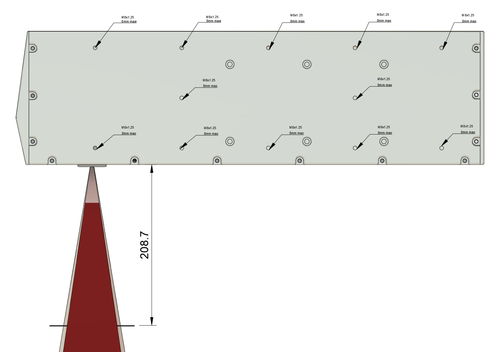
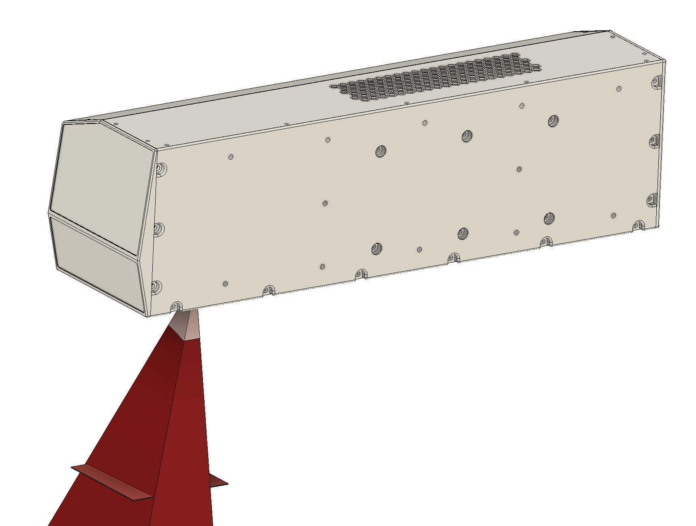

# 2. Intégration Mécanique

Cette section détaille les prérequis mécaniques pour l'installation du module laser au sein de votre équipement, ainsi que les principes d'alignement et d'encombrement pour garantir un fonctionnement optimal.

## 2.1 Fixation du module laser

Le système laser est conçu pour être fixé par sa platine latérale (située sur le côté de l'appareil).

* **Points de fixation :** Cette platine est équipée de 12 taraudages M8.
* **Contrainte critique :** La profondeur maximale de filetage utile est de 8 mm.
* **Entraxe :** Se référer au fichier 3D du laser pour l’entraxe de fixation.

> **ATTENTION :** L'utilisation de vis trop longues dépassant cette profondeur d'insertion de 8 mm à l'intérieur de la platine peut endommager irrémédiablement les composants internes du laser. Veillez à dimensionner vos vis en tenant compte de l'épaisseur de votre support d'intégration.

## 2.2 Distance focale et Zone de marquage

Pour obtenir une gravure nette et précise, la pièce à marquer doit être positionnée exactement au niveau du plan focal du laser.

* **Distance focale :** Elle est de 208,7 mm, mesurée de manière stricte entre la face inférieure de la platine basse du laser et la surface supérieure de la pièce à graver.
* **Zone de marquage :** Le champ de tir du laser couvre une surface maximale de 110 x 110 mm.
* **Aide à l'intégration CAO :** Pour faciliter la conception de votre outillage, le modèle 3D fourni intègre un carré rouge de 110 x 110 mm. La surface supérieure de ce carré virtuel matérialise le plan focal exact. Vous devez donc faire coïncider la surface à graver de votre pièce avec la face supérieure de ce carré rouge dans votre assemblage 3D.

## 2.3 Intégration de la caméra de relecture

Le système est équipé d'une caméra permettant la relecture de la zone gravée.

* **Champ de vision :** Dans le modèle 3D, la zone de visibilité de la caméra est modélisée par un prisme rouge.
* **Recommandation d'intégration :** Lors de la conception de votre machine, assurez-vous qu'aucun élément mécanique (bridage, capotage, câblage) ne vienne interférer avec ou obstruer le volume délimité par ce prisme rouge, sous peine de bloquer le champ de vision de la caméra.

## 2.4 Dégagements, Ventilation et Connectique

Afin de garantir le refroidissement et le bon raccordement du système, des espaces de dégagement doivent être prévus autour du laser :

* **Ventilation :** Il est impératif de ne pas obstruer les sorties d'air situées sous le laser ainsi que sur le carter. Un blocage de ces aérations pourrait entraîner une surchauffe du système.
* **Connectique arrière :** Prévoyez un espace libre de 100 mm minimum à l'arrière du module laser. Ce dégagement est nécessaire pour le passage, le branchement et le rayon de courbure des câbles de connectique sans créer de contraintes mécaniques.
