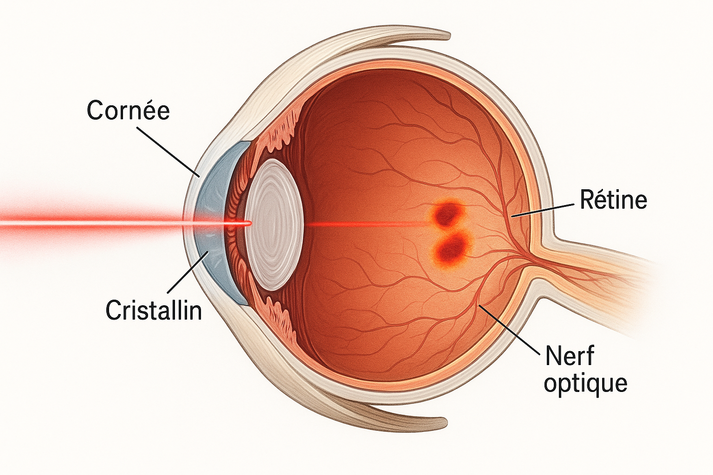
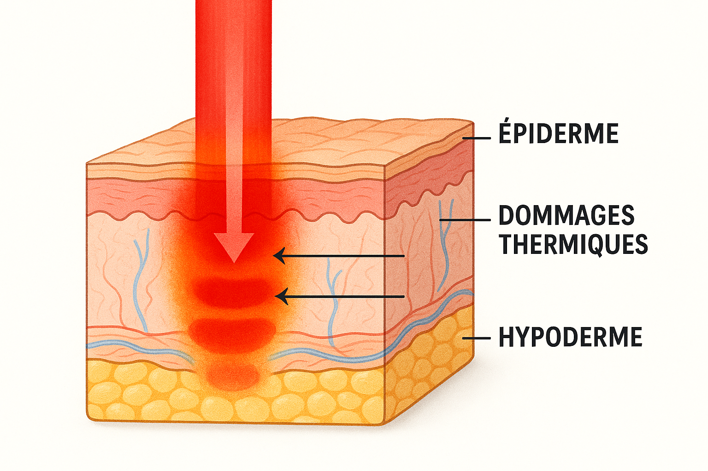
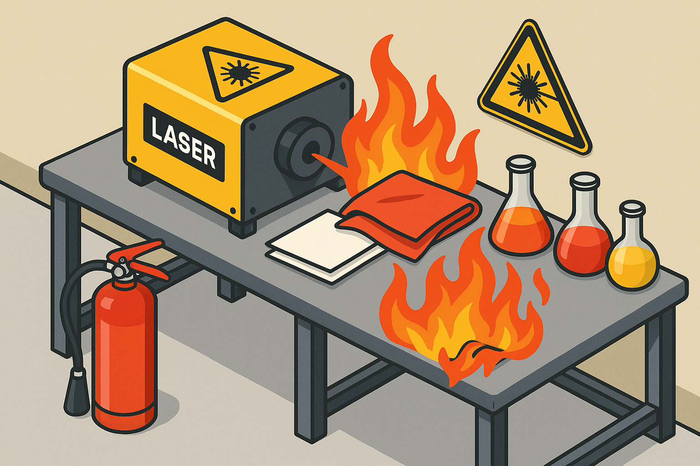
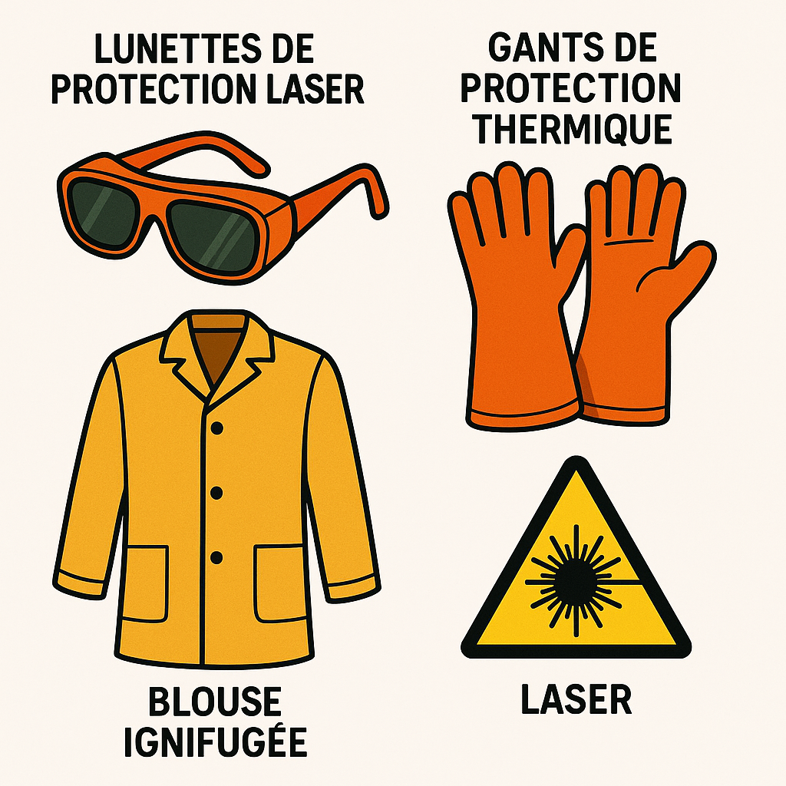

# Sécurité Laser : Comprendre et Prévenir les Risques

L'utilisation des lasers, bien que courante dans de nombreux domaines industriels, médicaux et de recherche, présente des risques significatifs qui nécessitent une compréhension approfondie et des mesures de sécurité strictes. Une exposition incorrecte ou non protégée à un rayonnement laser peut entraîner des dommages irréversibles aux yeux, des brûlures cutanées graves et même des incendies. Ce document a pour but de détailler ces risques et de présenter les mesures de prévention essentielles pour garantir un environnement de travail sûr.

## Risques pour les Yeux

Les yeux sont extrêmement vulnérables aux rayonnements laser, car le cristallin peut focaliser un faisceau laser sur la rétine, augmentant ainsi sa densité de puissance et son potentiel de dommage de manière exponentielle. Les lésions oculaires constituent le danger le plus grave associé à l'utilisation des lasers. [1]

Les dommages dépendent de la longueur d'onde du laser. Les longueurs d'onde courtes (proche infrarouge à visible) peuvent traverser les structures antérieures de l'œil et être absorbées par la rétine, provoquant des dommages permanents à la vision centrale. Les longueurs d'onde plus longues (infrarouge moyen et lointain) sont absorbées par la cornée et peuvent provoquer des brûlures douloureuses mais généralement non permanentes. [2]

| Longueur d'onde | Tissus oculaires affectés | Type de dommage potentiel |
| :--- | :--- | :--- |
| UV (UVB/UVC) | Cornée, Cristallin | Kératoconjonctivite, Cataracte (exposition chronique) [3] |
| Visible et proche IR | Rétine | Lésions rétiniennes permanentes, cécité |
| Moyen et lointain IR | Cornée | Brûlures cornéennes |

## Risques pour la Peau

L'exposition de la peau à un faisceau laser, en particulier ceux de haute puissance (Classe 3B et 4), peut provoquer des lésions graves. Les effets vont de l'érythème (rougeur) à des brûlures profondes et à la carbonisation des tissus. [3]

Le danger dépend de la puissance du laser, de la durée d'exposition, de la pigmentation de la peau et de la zone exposée. Les rayonnements ultraviolets (UV) et infrarouges (IR) sont particulièrement agressifs car ils sont fortement absorbés par les tissus cutanés. [3]

## Risques d'Incendie

Les lasers de haute puissance, en particulier ceux de Classe 4, génèrent une chaleur intense capable d'enflammer des matériaux combustibles. Ce risque est particulièrement présent dans les environnements de laboratoire et industriels où des solvants, des plastiques, des tissus ou d'autres matériaux inflammables peuvent se trouver à proximité du faisceau laser. [2]

Il est impératif de maintenir la zone de travail exempte de tout matériau inflammable et de disposer d'équipements d'extinction appropriés, tels qu'un extincteur et un bassin d'eau, à proximité immédiate de la zone d'opération du laser. [2]

## Classification des Lasers

Les lasers sont classés en fonction de leur potentiel de danger pour les yeux et la peau. Cette classification, définie par des normes internationales (IEC 60825-1), est essentielle pour déterminer les mesures de sécurité requises. [1]

| Classe | Danger | Exemples |
| :--- | :--- | :--- |
| **1 / 1M** | Sûr dans des conditions normales d'utilisation. | Lecteurs CD/DVD, imprimantes laser |
| **2 / 2M** | Faible puissance, visible. Le réflexe de clignement protège. | Scanners de codes-barres |
| **3R** | Danger modéré. L'exposition directe est potentiellement dangereuse. | Pointeurs laser |
| **3B** | Dangereux pour les yeux en cas d'exposition directe. | Lasers de recherche, projecteurs de spectacle |
| **4** | Très dangereux. Risque pour les yeux et la peau, risque d'incendie. | Lasers industriels, chirurgicaux |

## Mesures de Prévention et Équipement de Protection

La prévention des accidents laser repose sur une combinaison de contrôles techniques, de procédures administratives et d'équipements de protection individuelle (EPI).

- **Contrôles techniques :** Utilisation de boîtiers de protection, de systèmes de verrouillage et de signaux d'avertissement lumineux.
- **Procédures administratives :** Formation du personnel, zones de contrôle laser délimitées et signalisées, et nomination d'un responsable de la sécurité laser (LSO).
- **Équipement de Protection Individuelle (EPI) :** Le port de lunettes de protection spécifiques à la longueur d'onde du laser utilisé est **obligatoire** pour toute personne se trouvant dans la zone de danger. Des gants et des vêtements de protection ignifuges peuvent également être nécessaires. [2]

## Conclusion

La sécurité laser est une responsabilité partagée. Une compréhension claire des risques associés aux yeux, à la peau et aux incendies, ainsi que le respect rigoureux des classifications et des mesures de prévention, sont indispensables pour prévenir les accidents. En adoptant une culture de la sécurité et en utilisant systématiquement les équipements de protection appropriés, il est possible d'exploiter la puissance de la technologie laser tout en garantissant la sécurité de tous.

NWS Laser propose, dans sa Laser-Academy, une formation "Sécurité laser niveau 1 - opérateur". <a href="https://laser-academy.nws-tech.fr/formations/formation-securite-laser-niveau-1" target="_blank" rel="noopener noreferrer">Voir la formation</a>

---

### Références

[1] Occupational Safety and Health Administration (OSHA). "Laser Hazards". [https://www.osha.gov/laser-hazards/hazards](https://www.osha.gov/laser-hazards/hazards)

[2] Smalley, P. J. (2011). "Laser safety: Risks, hazards, and control measures". *Laser therapy*, 20(2), 95–106. [https://www.ncbi.nlm.nih.gov/pmc/articles/PMC3799025/](https://www.ncbi.nlm.nih.gov/pmc/articles/PMC3799025/)

[3] Institut National de Recherche et de Sécurité (INRS). "Rayonnement laser". [https://www.inrs.fr/risques/rayonnements-optiques/rayonnement-laser.html](https://www.inrs.fr/risques/rayonnements-optiques/rayonnement-laser.html)