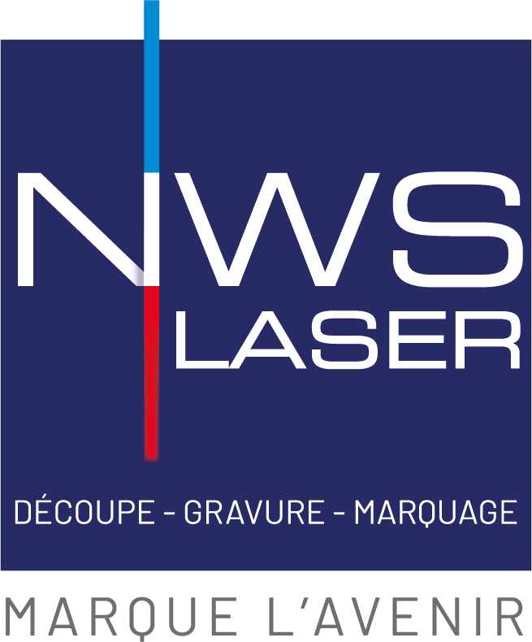

# Bienvenue dans le Centre de Documentation NWS Laser

!!! tip "Traduire cette page"
    Si vous souhaitez lire notre documentation dans une autre langue, vous pouvez utiliser Google Traduction pour traduire ce site web.

    Pour votre commodité, voici des raccourcis pour les langues les plus courantes :
    [Anglais (English )](https://translate.google.com/translate?sl=fr&tl=en&u=https://nwslaser.github.io/nwslaser-doc/ ) ·
    [Espagnol (Español)](https://translate.google.com/translate?sl=fr&tl=es&u=https://nwslaser.github.io/nwslaser-doc/ ) ·
    [Allemand (Deutsch)](https://translate.google.com/translate?sl=fr&tl=de&u=https://nwslaser.github.io/nwslaser-doc/ ) ·
    [Italien (Italiano)](https://translate.google.com/translate?sl=fr&tl=it&u=https://nwslaser.github.io/nwslaser-doc/ )

---

{ width="150" }

**Votre source unique pour tous les manuels, guides et ressources techniques concernant nos solutions de marquage laser.**

---

## Explorez nos documentations par gamme de produits

Ce portail est conçu pour vous fournir un accès rapide et facile à toutes les informations nécessaires pour installer, utiliser et maintenir votre équipement NWS Laser en toute sécurité et efficacité.

Naviguez directement vers la gamme de produits qui vous intéresse ou utilisez la barre de recherche en haut de la page pour trouver une information spécifique.

-   __LaserKube-X__

    ---

    Nos solutions compactes et sécurisées, idéales pour une intégration facile dans n'importe quel environnement de travail.

    [Consulter la documentation &rarr;](LaserKube/LaserKube-X/guide-demarrage-rapide_LK.md) 

-   __IK-Series-F20__

    ---

    La gamme de têtes laser intégrables, conçue pour une flexibilité maximale et des performances industrielles.

    [Consulter la documentation &rarr;](IK-Series/ik-series-f20.md)

-   __Solutions Spécifiques__

    ---

    Découvrez nos machines spécialisées comme l'IK-BOX, le CUT-M et le CUT-X-PRO, conçues pour des applications uniques.

    [Consulter la documentation &rarr;](IK-Box/index.md)

---

## Comment utiliser ce site ?

!!! tip "Quelques conseils pour une navigation optimale"

    *   **Menu de navigation :** Utilisez le menu sur la gauche pour explorer les différentes gammes de produits et accéder aux documents spécifiques (notices, guides de démarrage, etc.).
    *   **Barre de recherche :** La fonction de recherche est extrêmement puissante. Tapez un mot-clé ("focalisation", "LightBurn", "sécurité") pour trouver instantanément toutes les pages pertinentes.
    *   **Mode sombre :** Préservez vos yeux en passant au mode sombre grâce à l'icône de lune/soleil en haut de la page.

## Une ressource en constante évolution

!!! info "Mises à jour"
    Ce centre de documentation est un projet vivant. Nous nous engageons à l'enrichir et à le mettre à jour continuellement pour refléter les dernières améliorations de nos produits et logiciels. Si une section est marquée comme "en construction", soyez assuré qu'elle sera disponible très prochainement.

## Besoin d'aide ?

Si vous ne trouvez pas l'information que vous recherchez ou si vous avez besoin d'une assistance personnalisée, notre équipe de support technique est à votre disposition.

*   **Téléphone :** [+33 (0) 4 81 68 04 04](tel:+33481680404)
*   **Email :** [info@nwslaser.fr](mailto:info@nwslaser.fr)
*   **Site Web :** [https://nwslaser.fr](https://nwslaser.fr )
